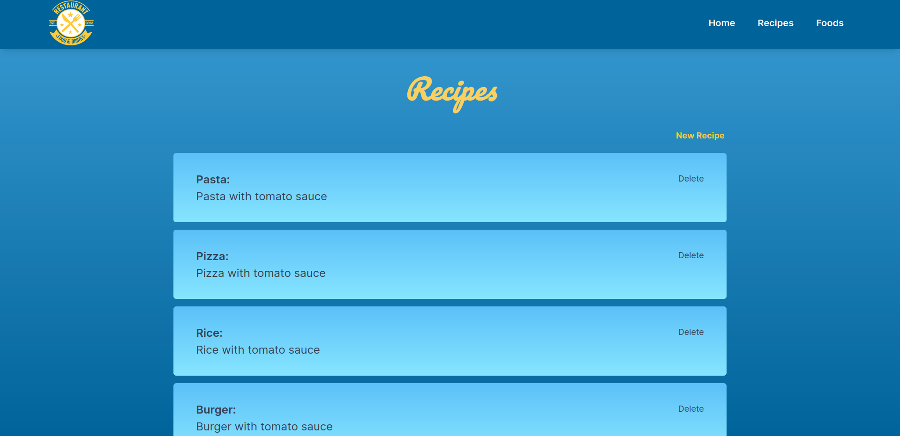
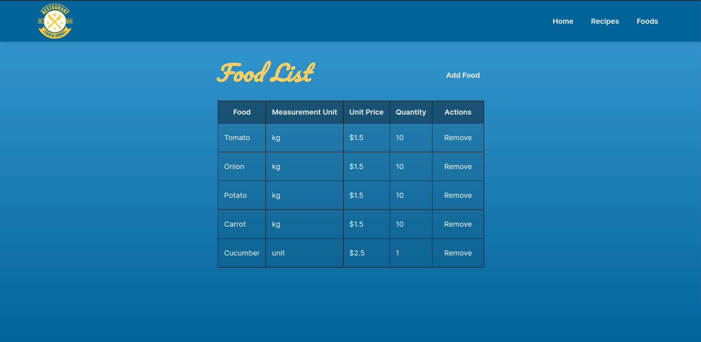
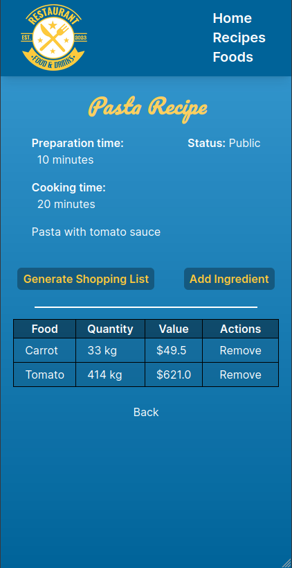
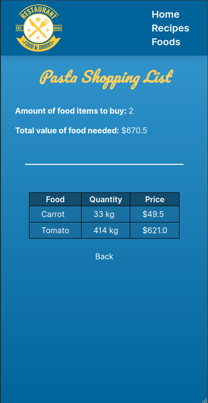

<a name="readme-top"></a>

# 📗 Table of Contents

- [📖 About the Project](#about-project)
  - [🛠 Built With](#built-with)
    - [Tech Stack](#tech-stack)
    - [Key Features](#key-features)
  - [🚀 Live Demo](#live-demo)
- [💻 Getting Started](#getting-started)
  - [Setup](#setup)
  - [Prerequisites](#prerequisites)
  - [Install](#install)
  - [Usage](#usage)
  - [Run tests](#run-tests)
  - [Deployment](#triangular_flag_on_post-deployment)
- [👥 Authors](#authors)
- [🔭 Future Features](#future-features)
- [🤝 Contributing](#contributing)
- [⭐️ Show your support](#support)
- [🙏 Acknowledgements](#acknowledgements)
- [❓ FAQ (OPTIONAL)](#faq)
- [📝 License](#license)

<!-- PROJECT DESCRIPTION -->

# 📖 BLOG APPLICATION <a name="about-project"></a>

**BLOG APPLICATION** is a classic example of a blog website implemented using the Ruby on Rails Frawework. 
The application is a fully functional website that shows the list of posts and empower readers to interact with them by adding comments and liking posts.


## 🛠 Built With <a name="built-with"></a>

### Tech Stack <a name="tech-stack"></a>

<details>
  <summary>Editor</summary>
  <ul>
    <li><a href="https://code.visualstudio.com/">VSCODE Editor</a></li>
  </ul>
</details>

<details>
  <summary>Server</summary>
  <ul>
    <li><a href="https://rubyonrails.org/">Ruby on Rails</a></li>
  </ul>
</details>

<details>
<summary>Database</summary>
  <ul>
    <li><a href="https://www.postgresql.org/">PostgreSQL</a></li>
  </ul>
</details>

### Key Features <a name="key-features"></a>

- **The Blog allows to create users**
- **The users created need to authenticate to publish posts**
- **The users can make leave comments and likes for the posts**

<p align="right">(<a href="#readme-top">back to top</a>)</p>

## 🚀 Live Demo <a name="live-demo"></a>

- Coming soon when the project is finished

## Screenshots

### Desktop
  
  

### Mobile
  
  


<p align="right">(<a href="#readme-top">back to top</a>)</p>

<!-- GETTING STARTED -->

## 💻 Getting Started <a name="getting-started"></a>

To get a local copy up and running, follow these steps.

### Prerequisites

In order to run this project you need:

- Basic knowledge of the command line.
- Ruby on Rails installed, you can follow this [link](https://guides.rubyonrails.org/v5.0/getting_started.html).
- Postgresql Database, you can follow this [link](https://www.postgresql.org/download/), choose your system & follow the provided instructions.

### Setup

Clone this repository to your desired folder:

```sh
  cd my-folder
  git clone git@github.com:Peter1907/recipe-app.git
```

### Install

Install this project with:
```sh
  cd recipe-app
  bundle install
```

Install tailwindcss gem to work properly:
```sh
  rails tailwindscss:install
```

### Usage

To run the project, execute the following command:


- To run the project in your browser, run:
```sh
  rails server
```
Or for short:
```sh
  rails s
```

- if you want to modify styles & let tailwind compile on save run:
```sh
  rails tailwindcss:watch
```

### Run tests

- You would have the necessary gems added to the Gemfile
- Open the terminal in the repo folder on your machine & run `bundle install` if you haven't already done so by this point
- In the terminal you have the option to run the tests for:
  - An entire folder, using the `rspec spec` command.
  - A sub-folder, using the `rspec spec/models` for example.
  - A single file, using the `rspec spec/requests/post_spec.rb` for example.

<p align="right">(<a href="#readme-top">back to top</a>)</p>

## 👥 Authors <a name="authors"></a>

👤 **Hans Zizold**

- GitHub:[@githubhandle](https://github.com/HansZizold) 
- Twitter:[@twitterhandle](https://twitter.com/hanzio27) 
- LinkedIn:[LinkedIn](https://www.linkedin.com/in/hans-paul-zizold-37129037/) 

👤 **Peter Beshara**

- GitHub: [@Peter1907](https://github.com/Peter1907)
- Twitter: [@Peter_Beshara_](https://twitter.com/Peter_Beshara_)
- LinkedIn: [LinkedIn](https://www.linkedin.com/in/peter-beshara-b33681241/)

<p align="right">(<a href="#readme-top">back to top</a>)</p>

<!-- FUTURE FEATURES -->

## 🔭 Future Features <a name="future-features"></a>

- [ ] **Deployment using Heroku**

<p align="right">(<a href="#readme-top">back to top</a>)</p>

## 🤝 Contributing <a name="contributing"></a>

Contributions, issues, and feature requests are welcome!

Feel free to check the [issues page](https://github.com/Peter1907/recipe-app/issues).

<p align="right">(<a href="#readme-top">back to top</a>)</p>

## ⭐️ Show your support <a name="support"></a>

Give a ⭐️ if you like this project!

<p align="right">(<a href="#readme-top">back to top</a>)</p>

<!-- ACKNOWLEDGEMENTS -->

## 🙏 Acknowledgments <a name="acknowledgements"></a>

- My loving family 😊
- My partners from Microverse
- Inspiration, Dedication

<p align="right">(<a href="#readme-top">back to top</a>)</p>

<!-- LICENSE -->

## 📝 License <a name="license"></a>

This project is [MIT](./LICENSE) licensed.

<p align="right">(<a href="#readme-top">back to top</a>)</p>
